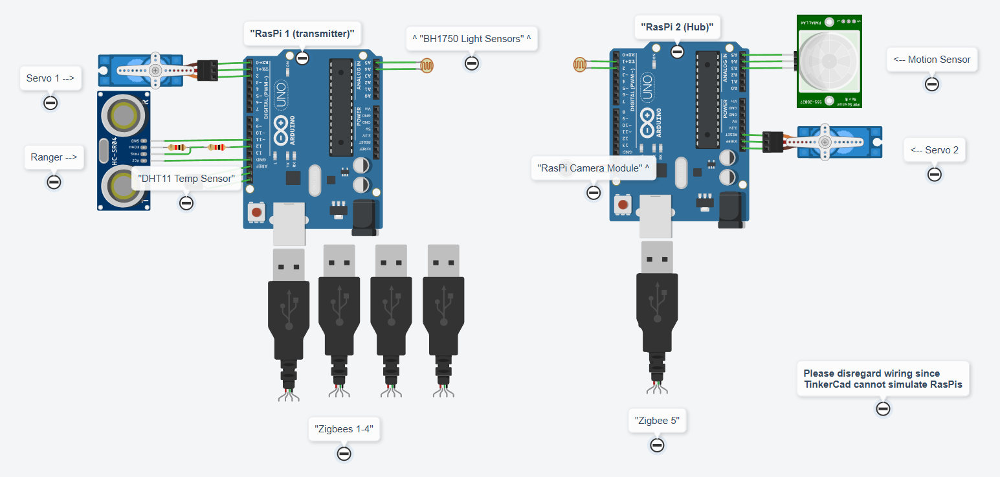

# 2026-Team-19-Smart-Home-System
This project builds a smart home system, complete with peripheral devices and a central hub that aggregates data, runs a BLE interface, and handles autonomous functions. 

## Table of Contents

- [Overview](#overview)  
- [Hardware Components](#hardware-components)  
- [Software and Dependencies](#software-and-dependencies)  
- [Usage](#usage) 
- [Results and Demonstration](#results-and-demonstration)  

##  Overview

In this project, we will demonstrate a prototype for a local smart home. Most smart homes depend on a subscription service like the cloud, but many people do not want/have such a service. The development of a local-smart home would provide a solution to this issue, and could be done using Bluetooth and Zigbee connections. This is particularly useful for those interested in personal privacy. Since our smart home operates locally, this technology also helps to alleviate the worries of consumers that a network outage would render their smart home dysfunctional. As we continued to implement aspects of our smart home into the prototype, we analyzed our success to find useful and realistic implementations for a fully local smart home system using Raspberry Pi. We will be addressing the questions of how feasible a fully local smart home would be, what the best approach method is, and what the most viable user interface would be.

The main features of our system include a peripheral sensor suite (HT, light, and ranger) and a peripheral actuator (servo motor) hosted on a RasPi. They communicate with a hub RasPi via Zigbee, and the user can interact with the system using a BLE interface. Our system also includes autonomous functions such as a live camera stream, automatic snapshotting of images based on motion, and light-level-based actuation.

## Hardware Components

- RasPi (x2)
- BH1750 Light Sensor (x2)
- DH11 HT Sensor
- 4-Pin Ultrasonic Ranger
- Zigbees (x5)
- Servo Motor (x2)
- RasPi Camera Module
- HC-SR501 Motion Sensor

## Software and Dependencies

All code written in Python3. In addition to standard Python libraries, ble_interface needs access to dbus-python. Several files are reused from IoT Lab code, but are included here locally, so no additional installation is needed. 

## Usage

### Hardware Setup

#### Pinout Information
- RasPi 1 (Hub):
    - Camera = camera ribbon slot

    - Motion sensor:
        - VCC = 5V
        - OUT = pin 7
        - GND = GND

    - Light sensor:
        - VCC = 3.3V
        - GND = GND
        - SDA = physical pin 3
        - SCL = physical pin 5
        - ADDR =  no connection

    - Curtain motor:
        - Signal = physical pin 37
        - VCC = 5V
        - GND = GND

    - ZigBee receiver:
        - Port 0

- Ras Pi 2 (Peripheral):
    - Ranger:
        - VCC = 5V
        - GND = GND
        - TRIG = pin 7
        - ECHO = voltage divider (with physical pin 11 and 1k + 2k ohm resistors)

    - Temp sensor:
        - VCC = 3.3V
        - DATA = pin 13
        - GND = GND

    - Light sensor:
        - VCC = 3.3V
        - GND = GND
        - SDA = pin 3
        - SCL = pin 5
        - ADDR = no connection

    - Motor:
        - Signal = pin 15
        - VCC = 5V
        - GND = GND

    - Zigbees:
        - All ports (any order)

### Software Setup

1. On the peripheral RasPi, run [ht_sensor.py](peripheral/sensors/ht_sensor.py), [light_sensor.py](peripheral/sensors/light_sensor.py), [ranger_sensor.py](peripheral/sensors/ranger_sensor.py), and [move_motor.py](peripheral/actuators/move_motor.py). Order does not matter, and no need to reconfigure port information if all four Zigbee modules are connected to the RasPi. 

2. On the hub RasPi, run [ble_interface.py](hub/hub_interface/ble_interface.py). Connect to the RasPi via LightBlue or another BLE app to access the manual read/write interface.

3. Write `0x61626364` or `b'abcd'` to the passkey characteristic to enable reading/writing to the interface

4. The above enables all core functions. To enable autonomous functions on the hub:
    - Run [secure_motion.py](hub/auto_functions/secure_motion.py) to enable auto-saving of camera snapshots locally when motion is detected
    - Run [website.py](hub/auto_functions/website.py) to enable localhost website for live camera stream
    - Run [curtains.py](hub/auto_functions/curtains.py) to enable autonomous actuation depending on the hub light sensor reading (simulate closing/opening of curtains at different times of day)
    - Run [motion_capture_better_website.py](hub/auto_functions/motion_capture_better_website.py) to enable auto-uploading of camera snapshots to localhost website when motion is detected.

## Results and Demonstration

Please see demonstrations and explanations in this [presentation](https://docs.google.com/presentation/d/1dIx4Tjf3L8oSGeemvZCGfK6FD13Ve1iN2CmIBH8TUzg/edit?usp=sharing)
